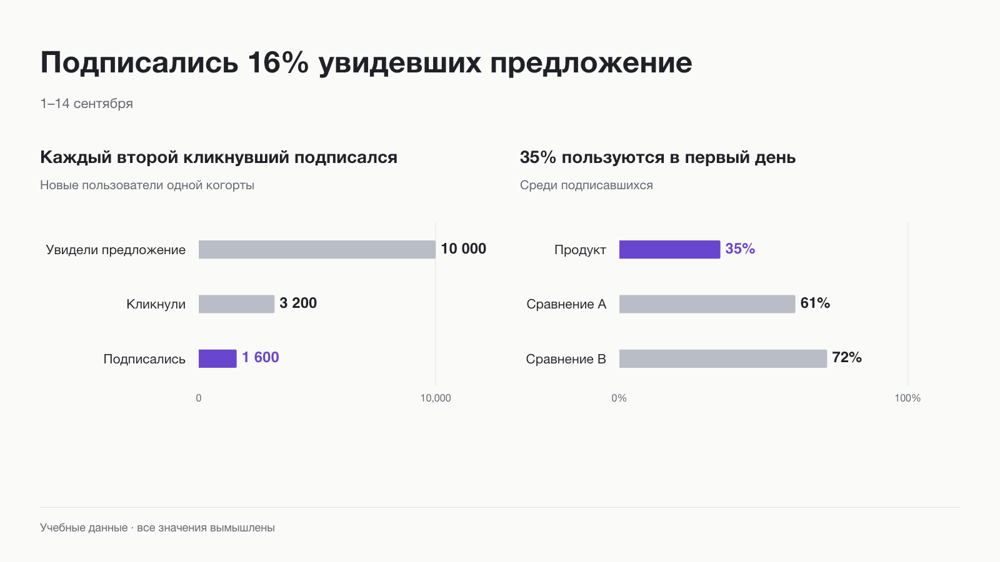

# Product Data Story



Переносимый скилл для аналитических отчётов: выбор графика, редактура текста и экспорт PNG / SVG / PDF. Атлас содержит 76 семейств и вариантов визуализации. Демо-данные полностью вымышленные.

Версия 4 добавляет редактируемые слайды PPTX / Figma Slides через инструменты агента, учебный PPTX и принцип «минимум текста, максимум понятности». Версия 3 добавила обязательную редактуру против ИИ-слопа и расширенный выбор графиков. Готовый JSON-генератор по-прежнему рисует пять типов: сравнение, воронку, динамику, состав и KPI. Для остальных агент выбирает форму из атласа, пишет отдельный локальный скрипт, строит и проверяет экспорт. Это расширенный рабочий процесс, а не 76 готовых JSON-шаблонов.

## Быстрая установка в Codex

Скачайте [готовый пакет из Releases](https://github.com/yadreamest/product-data-story/releases/latest), распакуйте папку `product-data-story` в `~/.codex/skills/` и откройте новую сессию.

Либо установите через Git:

```sh
git clone https://github.com/yadreamest/product-data-story.git ~/.codex/skills/product-data-story
```

Не запускайте эту команду поверх уже установленной папки: для существующей установки используйте обновление через Git или замените папку вручную, сохранив свои изменения.

## Установка зависимостей генератора

Нужен Python 3.11+. В терминале из папки скилла:

```sh
python3 -m venv .venv
.venv/bin/python -m pip install -r requirements.txt
.venv/bin/python scripts/render.py examples/demo.json --out demo-report
```

На Windows используйте `.venv\Scripts\python.exe`. После первоначальной установки библиотек генерация работает локально без сети. Это не приложение с кнопками: агент готовит входной JSON, готовый скрипт рисует графики. Качество исходных метрик агент проверяет по источнику.

Для установки в Codex скопируйте всю папку `product-data-story` в `~/.codex/skills/` и откройте новую сессию. В другом агенте дайте ему `SKILL.md` как инструкцию; автоматическое обнаружение зависит от конкретного клиента.

Пример запроса:

> Используй product-data-story. Вот CSV по неделям. Сделай короткий отчёт по активации: вывод, воронка и динамика. Подпиши базу, период и источник; выгрузи PDF и PNG.

Проверка входа не требует Matplotlib; полный набор тестов запускайте после установки зависимостей:

```sh
python3 scripts/render.py examples/demo.json --validate-only
.venv/bin/python -m unittest discover -s scripts -p 'test_*.py'
```

## Распространение

Передавайте ZIP целиком. В нём инструкции, дизайн-правила, генератор и вымышленные примеры. Реальные отчёты и данные храните вне этой папки. Не включены личные пути, ключи, скриншоты пользователя, исходные данные компании или зависимости от конкретных агентов. Окончательное утверждение дизайна остаётся за владельцем.

Дизайн сохраняет встроенные Inter 4.1 Regular / Medium / SemiBold; отдельная установка шрифта для генерации не нужна. Файлы шрифта и оригинальная лицензия находятся в `assets/fonts/`. Для редактирования текста SVG установите эти шрифты в редакторе.

Быстрый генератор рассчитан на вертикальные записки до трёх блоков. Остальные формы и компоновки выполняются через расширенный режим, если есть подходящие данные и инструменты. Новые типы не добавлены в JSON-схему `render.py`.

Каждый запуск использует новую или пустую папку `--out` (например, `report-v2`). Генератор не перезаписывает предыдущий отчёт. Файлы публикуются только после успешной отрисовки и автоматической проверки границ текста.

## Выбор формы и язык

- [Редактура текста](references/editorial.md): конкретные факты вместо канцелярита, пустых усилителей и недоказанных причин.
- [Атлас графиков](references/chart-atlas.md): сравнения, время, распределения, связи, состав, потоки, география и специальные задачи.
- [Расширенное построение](references/advanced-rendering.md): как агент строит график вне пяти быстрых шаблонов.

Пример: «Используй product-data-story. Выбери подходящий график для распределения длительности сессий, сохрани Inter. Убери ИИ-слоп из пояснений, но сохрани ограничения данных. Сделай PDF и PNG».

## Слайды

[Редактируемые слайды](references/slides-and-editability.md): единые данные, два варианта редактирования. В `examples/editable-slide.pptx` — две нативные диаграммы с вложенными таблицами. Для сохранения типографики при редактировании установите Inter из `assets/fonts`.

## Лицензия

Код, инструкции и учебные примеры — MIT. Шрифт Inter распространяется отдельно по SIL Open Font License; оригинальная лицензия находится в `assets/fonts/LICENSE.txt`.
